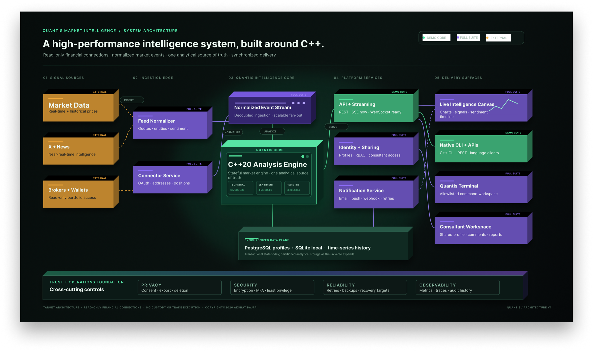
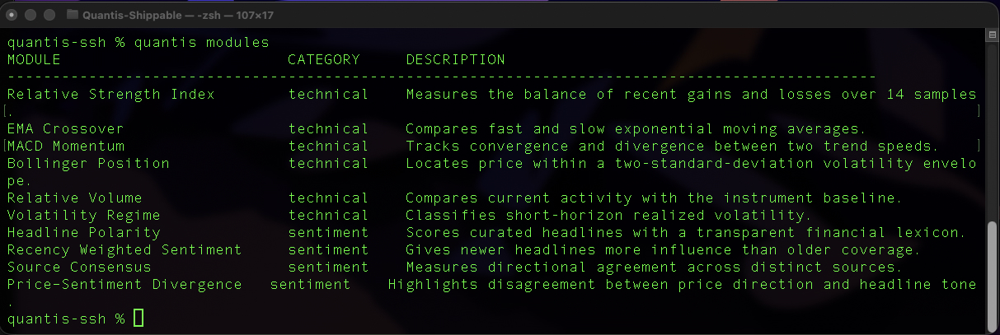
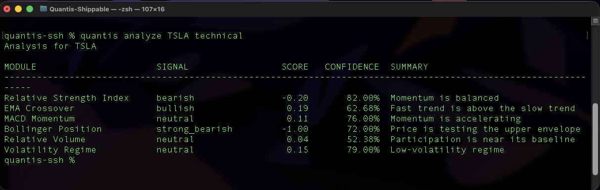
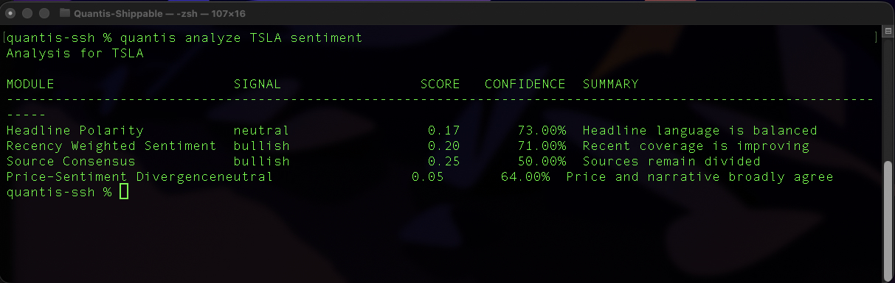

# Quantis Market Intelligence

<p align="center">
  <strong>A high-performance market-intelligence system built around a native C++20 engine.</strong>
</p>

<p align="center">
  Technical signals, explainable sentiment, synchronized research workflows, and consistent delivery across web, CLI, and API surfaces.
</p>

<p align="center">
  <a href="https://www.quantisresearch.com/"><strong>Open the live preview</strong></a>
  &nbsp;&middot;&nbsp;
  <a href="#system-design">Architecture</a>
  &nbsp;&middot;&nbsp;
  <a href="#demo-versus-full-suite">Product scope</a>
  &nbsp;&middot;&nbsp;
  <a href="#demonstration-gallery">Demonstration gallery</a>
</p>

<p align="center">
  
</p>

> **Demonstration release.** Quantis currently uses simulated prices and curated headlines. Signals are provided for educational research and product evaluation, not investment advice. No brokerage connection, custody, payment flow, trading transaction, or order execution is present in the demo.

## System design

<p align="center">
  
</p>

The diagram separates three states clearly:

- **Demo core:** capabilities operating in the current product demonstration.
- **Full suite:** target services and delivery surfaces planned around the existing analytical core.
- **External:** licensed data, news, social, brokerage, and wallet providers that remain outside Quantis.

The C++20 engine stays intact as the analytical source of truth. Identity, OAuth, notifications, profile collaboration, visualization, and device synchronization belong around it, not inside it. This keeps engine modules independently testable and allows the same capability to surface through the CLI, API, terminal, and web workspace.

## The product


https://github.com/user-attachments/assets/94bdb298-c4f0-4661-ba9d-dfb2777fb0b2


Quantis turns a market snapshot into a structured research view. A stateful C++20 engine owns market state and analysis; the web workspace, native CLI, and REST API consume the same typed results. Indicators are calculated once, exposed consistently, and kept separate from presentation logic.

The current release is intentionally narrow: a credible, end-to-end demonstration of the product architecture rather than a claim of production-market coverage. The planned full suite expands the universe, collaboration model, data integrations, and operational envelope while preserving the native engine as the analytical center of gravity.

| Current demonstration | At a glance |
| --- | --- |
| Analytical core | Native C++20 stateful engine |
| Surfaces | React workspace, native CLI, JSON REST API |
| Live delivery | One-second server-sent snapshots |
| Analysis registry | 6 technical + 4 sentiment modules |
| Demonstration universe | 12 curated U.S. equities |
| State | PostgreSQL-hosted profiles; SQLite local persistence |
| Access | Invitation codes, access requests, secure server sessions |
| Data posture | Simulated prices and curated headlines |

## One engine, multiple surfaces

The analysis registry is the contract. A registered module carries its metadata, category, signal, score, confidence, value, unit, summary, and supporting insights through every interface.

| Surface | What it demonstrates |
| --- | --- |
| **Native CLI** | Module discovery, technical and sentiment analysis, persistent watchlists, and a one-second live monitor |
| **REST API** | Authenticated JSON endpoints for profiles, snapshots, modules, analysis, watchlists, and streaming |
| **Web workspace** | Overview, live screener, technical analysis, sentiment analysis, and synchronized ticker management |
| **Documentation** | Product navigation, CLI reference, endpoint guide, and request examples inside the application |

This boundary is deliberate: the UI renders engine output; it does not reimplement financial calculations in TypeScript.

## Native CLI

> **Supported today.** The current demonstration includes a native C++20 command-line interface backed by the same engine and analysis registry used by the web workspace and REST service.

The CLI supports module discovery, one-shot analysis, a persistent local watchlist, and a continuously refreshing market view.

| Command | Current behavior |
| --- | --- |
| `quantis version` | Print the installed native-client version |
| `quantis modules` | Discover every registered technical and sentiment module |
| `quantis analyze SYMBOL technical` | Run all six technical modules for a supported demonstration ticker |
| `quantis analyze SYMBOL sentiment` | Run all four sentiment modules for a supported demonstration ticker |
| `quantis add SYMBOL` | Add a supported ticker to the local watchlist |
| `quantis remove SYMBOL` | Remove a ticker from the local watchlist |
| `quantis list` | Render the latest snapshot for every watched ticker |
| `quantis live` | Refresh prices, change, volume, risk, and alerts once per second |

```console
$ quantis modules
MODULE                         CATEGORY     DESCRIPTION
Relative Strength Index        technical    Measures the balance of recent gains and losses.
EMA Crossover                  technical    Compares fast and slow exponential moving averages.
Headline Polarity              sentiment    Scores curated headlines with a transparent lexicon.

$ quantis analyze TSLA technical
Analysis for TSLA
MODULE                         SIGNAL       SCORE    CONFIDENCE
Relative Strength Index        bearish      -0.20        82.00%
EMA Crossover                  bullish       0.19        62.68%
```

Watchlist state is persisted locally through SQLite. Analysis commands query the native registry directly, so the CLI does not require the React application to calculate or display results.

<p align="center">
  
</p>


https://github.com/user-attachments/assets/fd2b7c3f-3c21-4ccc-9115-f6163c564e0c


## REST API

> **Supported today.** The demonstration exposes an authenticated JSON REST API and a server-sent event stream from the C++ service.

The API is the contract between the native engine and the product surfaces. It exposes profiles, synchronized watchlists, market snapshots, module discovery, technical analysis, sentiment analysis, and one-second live updates.

| Method | Endpoint | Current behavior |
| --- | --- | --- |
| `GET` | `/api/v1/health` | Service and native-engine health |
| `POST` | `/api/v1/access/verify` | Exchange an invitation code for a secure session |
| `POST` | `/api/v1/access/request` | Submit a preview-access request |
| `POST` | `/api/v1/logout` | Revoke the current session |
| `GET` | `/api/v1/profile` | Current profile and synchronized watchlist |
| `GET` | `/api/v1/snapshot` | Current simulated market universe |
| `GET` | `/api/v1/modules` | Registered analysis-module catalog |
| `GET` | `/api/v1/analysis/:symbol/:category` | Technical or sentiment results for one symbol |
| `GET` | `/api/v1/stream` | One-second server-sent snapshot stream |
| `POST` | `/api/v1/watchlist` | Add a supported symbol to the synchronized watchlist |
| `DELETE` | `/api/v1/watchlist/:symbol` | Remove a symbol from the synchronized watchlist |

With the exception of the health and access entry points, requests use the secure `quantis_session` cookie returned after invitation-code verification.

```bash
# Exchange a private invitation code for a server-managed session.
curl -c quantis-cookie.txt \
  -H "Content-Type: application/json" \
  -d '{"code":"<ACCESS_CODE>"}' \
  https://www.quantisresearch.com/api/v1/access/verify

# Request the engine's typed technical-analysis results.
curl -b quantis-cookie.txt \
  https://www.quantisresearch.com/api/v1/analysis/TSLA/technical
```

Analysis responses include module metadata, signal direction, score, confidence, measured value, unit, summary, and supporting insights. The API returns research data only; it exposes no brokerage, custody, order, payment, or transaction endpoint.

## Demonstration gallery

### Native analysis

<table>
  <tr>
    <td width="33%"></td>
    <td width="33%"></td>
    <td width="33%"></td>
  </tr>
  <tr>
    <td align="center"><strong>Module registry</strong></td>
    <td align="center"><strong>Technical analysis</strong></td>
    <td align="center"><strong>Sentiment analysis</strong></td>
  </tr>
</table>

### Recorded workflows

| Experience | Clip | What to look for |
| --- | --- | --- |
| Market pulse | [Watch overview](assets/video/header.mp4) | Breadth, watched assets, alerts, risk, and module inventory |
| Live native engine | [Watch CLI stream](assets/video/quantis%20live.mp4) | Stateful one-second updates, risk scores, volume, and anomaly alerts |
| Technical workbench | [Watch technical analysis](assets/video/technical%20analysis.mp4) | Six auto-discovered modules with signals, values, confidence, and explanations |
| Sentiment workbench | [Watch sentiment analysis](assets/video/sentimental%20analysis.mp4) | Four interpretable modules using curated demonstration headlines |

## Analysis available today

| Technical | Purpose | Sentiment | Purpose |
| --- | --- | --- | --- |
| Relative Strength Index | Balance of recent gains and losses | Headline Polarity | Transparent lexical tone scoring |
| EMA Crossover | Fast-versus-slow trend comparison | Recency Weighted Sentiment | Greater weight for newer coverage |
| MACD Momentum | Trend-speed convergence and divergence | Source Consensus | Directional agreement across sources |
| Bollinger Position | Price location inside a volatility envelope | Price-Sentiment Divergence | Disagreement between price and narrative |
| Relative Volume | Current participation versus baseline |  |  |
| Volatility Regime | Short-horizon realized-volatility classification |  |  |

Every result includes an interpretable signal, normalized score, confidence value, plain-language summary, and supporting insights. The demonstration favors transparent heuristics over unexplained recommendations.


https://github.com/user-attachments/assets/e37cfcfd-60a1-4005-aba9-751799cc24a5


https://github.com/user-attachments/assets/3b052200-7798-4e52-8d86-07713c47d511


## Demo versus full suite

The full-suite column describes the current system-design target. It is not a claim that those capabilities, capacities, integrations, or service levels are available today.

### Functional scope

| Area | Demonstration release | Full-suite target |
| --- | --- | --- |
| Market universe | 12 curated U.S. equities | Stocks, ETFs, and crypto initially; architecture extensible to additional classes |
| Market data | Simulated one-second snapshots | Licensed real-time and historical feeds |
| News and social intelligence | Curated demonstration headlines | Active news and X tracking with deduplication, relevance, credibility, and sentiment processing |
| Analysis | 6 technical and 4 sentiment modules | Expandable technical and sentiment packs registered once in the C++ engine |
| Visualization | Overview, screener, module cards, risk, breadth, and alerts | Live candlesticks, volume, overlays, signal markers, sentiment timelines, exposure, and historical playback |
| Ticker management | Add or remove instruments from the supported demonstration universe | Broad search and tracking across the licensed instrument universe |
| Profiles | Invitation-controlled shared demonstration workspace | Private individual, household, team, and consultant-managed workspaces |
| Sharing | Not enabled | Owner, Editor, Consultant, Viewer, and expiring shared-link permissions |
| Device continuity | Server-side session and synchronized demonstration watchlist | Personal near-real-time multi-device synchronization with server-authoritative state |
| Notifications | Access-request persistence and optional owner email | Email, web push, mobile push, webhook, and optional SMS with retries and quiet hours |
| Financial connections | None | Read-only wallet and brokerage connectors with revocable, least-privilege access |
| Wallet direction | None | Public-address and approved-connection flows for MetaMask, Phantom, and Solflare; never seed phrases or private keys |
| Brokerage direction | None | Official or approved read-only integrations, including Coinbase Advanced Trade and supported brokerage providers |
| Terminal | Native operating-system CLI | Allowlisted in-product Quantis command console; never an unrestricted system shell |
| Transactions | No trading or custody | Read-only baseline; execution requires a separate product, security, and compliance decision |

### Non-functional targets

| Dimension | Demonstration release | Full-suite design target |
| --- | --- | --- |
| Intended scale | Roughly 100 invitees and about 20 concurrent viewers | 10,000 profiles and 1,000 concurrent users at launch |
| Per-profile universe | Supported demonstration tickers | Up to 250 tracked instruments across supported asset classes |
| Availability | Best effort; no SLA | 99.9% monthly availability objective |
| Device synchronization | Shared PostgreSQL-backed preview state | Personal synchronization target below two seconds while online |
| Offline notification | Access-request email only | Durable alert delivery with retry, deduplication, preferences, and quiet hours |
| Recovery | Transactional writes and reconnecting live streams; no formal recovery commitment | Recovery-point target of five minutes and recovery-time target of one hour |
| Privacy | Minimal invitation, request, session, and watchlist information; no financial credentials | Consent, purpose limitation, export, deletion, retention controls, and integration revocation |
| Security | Digested access codes and tokens, cryptographically random sessions, secure cookies, rate limits, and browser security headers | MFA or passkeys, tenant isolation, encrypted connector tokens, managed secrets, audit history, WAF, and continuous security monitoring |
| Observability | Health endpoint and service logs | Structured logs, metrics, distributed traces, SLO alerts, and synthetic checks |
| Accessibility | Responsive web interface and reduced-motion-aware presentation | WCAG-aligned interaction, keyboard coverage, contrast validation, and reduced-motion parity |

Scaling targets assume horizontally deployed stateless APIs, replicated C++ engine workers, asynchronous event processing, caching, and storage partitioning. Market-data latency and social-data latency remain bounded by the selected external providers.

## Security and privacy posture

The demonstration minimizes the amount of data it needs:

- Access codes and session identifiers are persisted as keyed digests rather than plaintext credentials.
- Session identifiers use cryptographic randomness and server-managed cookies.
- Hosted cookies are `HttpOnly`, `Secure`, and `SameSite` constrained.
- Access and invitation-request entry points are rate limited.
- Browser security headers restrict framing, content sources, referrers, permissions, and content sniffing.
- Profile state remains server-side; the browser cannot decode or rewrite it from the session cookie.
- No brokerage secrets, wallet private keys, seed phrases, payment information, or trading credentials are collected.

The full suite would add tenant-level authorization, immutable audit events, managed-key encryption, verified identities, formal backup and recovery procedures, security testing, and explicit data-lifecycle controls. These are design requirements, not current certifications.

## Technology profile

| Layer | Demonstration implementation |
| --- | --- |
| Engine and CLI | C++20, CMake, stateful instrument histories, reader-writer synchronization |
| Analysis | Extensible native module registry with typed metadata and results |
| Service | C++ HTTP server, JSON REST endpoints, server-sent events |
| Web | React 19, TypeScript 5.9, Vite 8 |
| Persistence | PostgreSQL for hosted state; SQLite for local CLI and development state |
| Security primitives | OpenSSL-backed cryptography, secure cookies, rate limiting, security headers |
| Delivery | Containerized deployment with health checks and managed PostgreSQL connectivity |

## Product principles

1. **One analytical source of truth.** Signals originate in the native engine and remain consistent across interfaces.
2. **Explain before recommending.** Every signal carries a score, confidence, summary, and inspectable supporting context.
3. **Keep integrations read-only by default.** Portfolio visibility does not require custody or trade execution.
4. **Separate shipped capability from direction.** Demo features and full-suite targets are labeled independently.
5. **Design privacy into the data model.** Collect less, isolate access, and make connections revocable.
6. **Extend without fragmenting.** New modules should appear across CLI, API, terminal, and UI without parallel implementations.

## Repository scope

This public repository is a product brief and media showcase. It intentionally does **not** distribute the private Quantis implementation, including the complete C++20 engine, CLI source, API server, authentication and profile services, React source, database implementation, deployment configuration, or future integration code.

The boundary is intentional: visitors can evaluate the product, architecture, interface quality, and engineering direction without turning the public repository into the product's source distribution.

## Access

The hosted demonstration is invitation-only. Visit [www.quantisresearch.com](https://www.quantisresearch.com/) to enter an access code or submit an access request.

The current preview is designed for controlled evaluation. Access may be limited, revoked, or temporarily unavailable while the demonstration environment is maintained.

## Ownership and permitted use

Copyright &copy; 2026 Akshat Bajpai. All rights reserved.

Quantis, its product identity, documentation, diagrams, screenshots, recordings, and non-public implementation are proprietary. This repository is provided for evaluation and portfolio presentation. No license is granted to reproduce, redistribute, create derivative works from, or commercially use these materials without prior written permission, except where applicable law provides otherwise.

Third-party technologies and services retain their respective trademarks, licenses, and copyrights. References to planned integrations describe product direction and do not imply endorsement, partnership, or current availability.

---

<p align="center">
  <strong>Quantis</strong><br />
  Research infrastructure, simplified.<br /><br />
  <a href="https://www.quantisresearch.com/">Live preview</a>
  &nbsp;&middot;&nbsp;
  <a href="https://akshatbajpai.com/">Portfolio</a>
</p>
